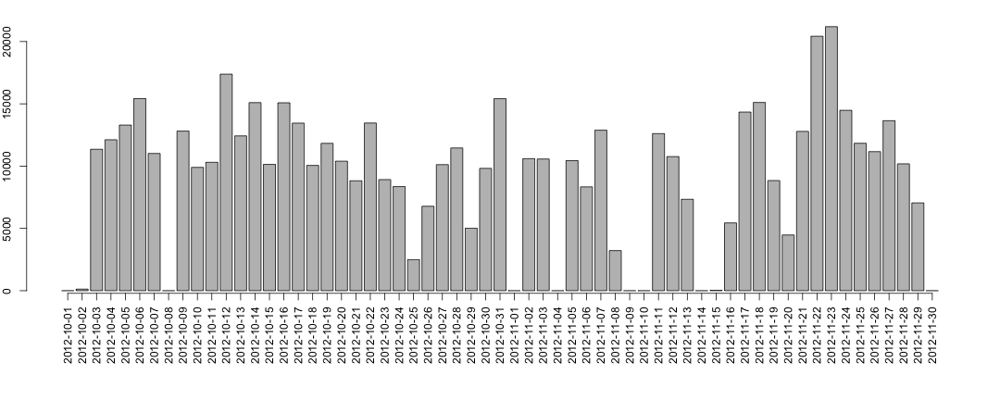
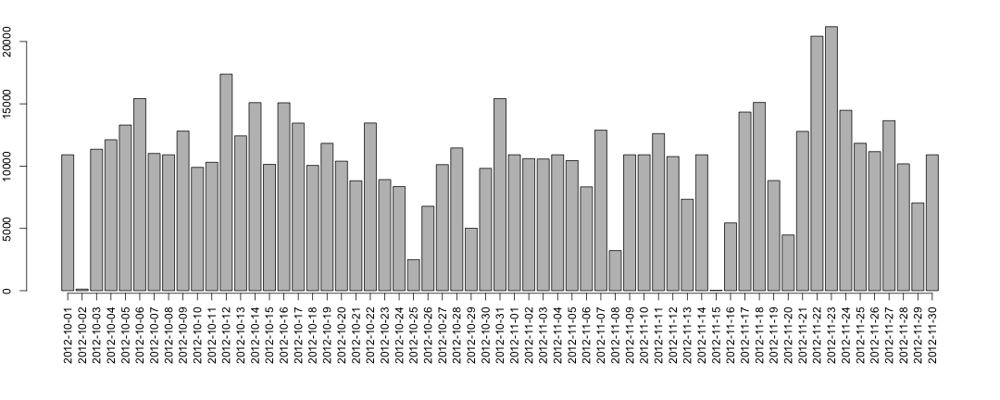
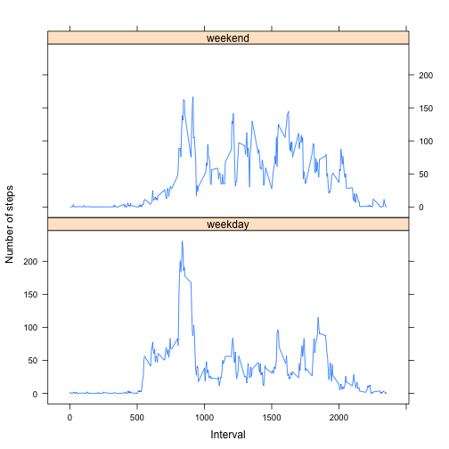

# Reproducible Research: Peer Assessment 1


## Loading and preprocessing the data


```r
data <- read.csv("activity.csv", colClasses = c("numeric", "Date", "numeric"))
```


## What is mean total number of steps taken per day?

Histogram of the total number of steps taken each day

```r
stepsEachDay <- aggregate(data$steps, by = list(data$date), FUN = sum, na.rm = TRUE)
par(mar = c(8, 2, 2, 2))
bp <- barplot(stepsEachDay$x, las = 3)
axis(1, at = bp, labels = stepsEachDay$Group.1, las = 3)
```

 


Mean and median total number of steps taken per day

```r
mean(stepsEachDay$x)
```

```
## [1] 9354
```

```r
median(stepsEachDay$x)
```

```
## [1] 10395
```


## What is the average daily activity pattern?


```r
stepsEach5Mins <- aggregate(data$steps, by = list(data$interval), FUN = mean, 
    na.rm = TRUE)
plot(stepsEach5Mins$Group.1, stepsEach5Mins$x, type = "l")
```

 


Which 5-minute interval, on average across all the days in the dataset, contains the maximum number of steps?

```r
stepsEach5Mins[which(stepsEach5Mins$x == max(stepsEach5Mins$x)), ]$Group.1
```

```
## [1] 835
```


## Imputing missing values


```r
library(plyr)
impute.steps <- function(x) replace(x, is.na(x), ceiling(mean(x, na.rm = TRUE)))
data <- ddply(data, ~interval, transform, steps = impute.steps(steps))
stepsEachDay <- aggregate(data$steps, by = list(data$date), FUN = sum, na.rm = TRUE)
par(mar = c(8, 2, 2, 2))
bp <- barplot(stepsEachDay$x, las = 3)
axis(1, at = bp, labels = stepsEachDay$Group.1, las = 3)
```

 

```r
mean(stepsEachDay$x)
```

```
## [1] 10785
```

```r
median(stepsEachDay$x)
```

```
## [1] 10909
```


## Are there differences in activity patterns between weekdays and weekends?

```r
library(lattice)
data$Day <- weekdays(data$date)
data$dayType[data$Day == "Sunday"] <- "weekend"
data$dayType[data$Day == "Saturday"] <- "weekend"
data$dayType[is.na(data$dayType)] <- "weekday"
data$dayType <- as.factor(data$dayType)
stepsEach5Mins <- aggregate(data$steps, by = list(data$interval, data$dayType), 
    FUN = mean, na.rm = TRUE)
xyplot(stepsEach5Mins$x ~ stepsEach5Mins$Group.1 | stepsEach5Mins$Group.2, layout = c(1, 
    2), type = "l", xlab = "Interval", ylab = "Number of steps")
```

 

